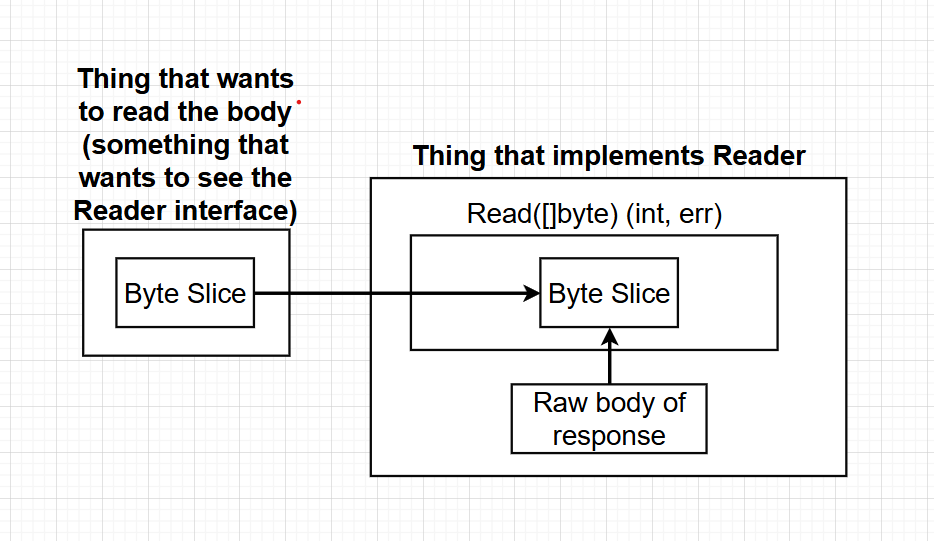

> These contains notes of sections after 29

### Go commands

1. `go run`, this command compiles code in one or more file and immediately executes them.
2. `go build`, this command code in one or more files. It creates an executable file that can be run whenever needed.
3. `go install`, compiles and installs a package.
4. `go get`, downloads the raw source code of someone else's package.

### Go Packages

1. Package == Project
2. A package is a collection of common source code files.
3. Each go file belongs to a package.
4. The files serving common objective or files belong to a particular project should belong to same package.
5. There are 2 types of packages in Go:
   1. Executable type, these, when compiled, generates a file that we can run.
   2. Reusable type, these are used as helpers to other projects/packages. These are like code dependencies or libraries.
6. The name of the package defines whether the package is an executable type or reusable type.
7. The word `main` is used to make an executable type package, `package main`. **`package main` ---> go build ---> main.exe**. When the main.exe is executed, the main() present in the function will automatically gets executed.
8. Any other work, except `main`, on building, will not give an executable file.**`package <anything>` ---> go build ---> nothing!!**.
9. Note, the files that are under package main must have a main() inside them. It means, out of all the files under `package main`, only one file should have main().

### `import <package>`

1. The importing of package is done so that our current package can have access to the code inside the imported package.
2. Some packages come as part of standard library of Go like "fmt". You can read about them on `golang.org/pkg`

### Declaring Variables

1. Go is a statically typed language, means we need to predefine the type of variable
2. Method 1 :- `var <variable-name> <variable-type> = <value>`, eg. `var name string = "Aniket Hans"`.
3. Method 2 :- `<variable-name> := <value>`, eg `name := "Aniket Hans"`
4. The `:=` will only be used at the time of declaring the variable, not while re-assigning value to it. E.g `name := "Aniket Hans"; name = "AH"`
5. You can't declare global variables using `:=`, you have to use `var` for declaring global variables.
6. If you dont use any declared variable in your code, then Go will throw error.

### Function Declarations

1. Syntax:- `func <function-name>() <return-type> {}`. E.g. `func getName() string{}`

### Arrays

1. Fixed length list of records
2. Every element in a array should be of same type.

### Slice

1. Slice is an array that can grow or shrink.
2. Every element in a slice should be of same type.
3. Syntax:- `<variable> := []<type of slice>{data1,data2}`, eg. cards := []string{"ace of spade", "king of hearts"}
   `var <variable> = []<type of slice>{data1,data2}`, eg. var cards = []string{"ace of spade", "king of hearts"}
4. Adding new element to slice, `<slice-variable> = append(<slice-variable>, <new value>)`, e.g. cards = append(cards,"Queen of Diamonds")
5. `append()` does not modify the existing slice, instead it returns a new slice which is assigned back to the variable.

### For loop

1. Looping over a slice, `for <index variable>, <value> := range <slice-variable> {}`

### OOPs in Go

1. Go is not an Object Oriented Programming language as there are no classes in Go.
2. In classes, we have properties (variable) in classes and methods (functions inside class), which use the properties to perform operations and give some result.
3. In Go, we first create a custom type and then make a receiver function that will receives the object/variable of custom type to perform some operations and give result.
4. The custom type can be a string, []string, struct etc.

### Defining type

1. Syntax: `type <type-name> <type>` e.g making a type of []string, `type name []string`. Here, name will have all the properties of []string.
2. Both of these are similar:-
   1. humans := []string{"AH","DH"}
   2. humans := name{"AH","DH"}
3. We can also define type on primitive data types. Eg. `type customString string`. We can define customType variables in 2 types:
   1. Using var, `var s1 customString = "hello"`
   2. Using :=, `s2 := customString("hi")`

### Receiver function

1. Syntax:- `func (<variable> <type-of-variable>) <function-name>() <return-type>{}`
2. E.g. for type name, `func (n name) printNames() {}`
3. The receiver function printNames here will have access to the `n` variable which is of type []string and can perform oerations on it.
4. The receiver function is called using the object/variable of type `name`, eg. humans.printNames()
5. We can consider, loosely, the variable defined using `type` as class and properties and the receiver function as class methods which can be invoked by objects of type defined and the methods have access to the properties of calling object.
6. ```go
    type name []string // Its like declaring class name with one property of type []string
   func (n name) printNames(){ // Its like defining the method of class name
        for i, name := range n{
        fmt.Println(i,name)
        }
   }

   humans := name{"AH","DH"} // Its like initializing object humans of name class.
   humans.printNames() // class objects can be used to call the class methods
   ```

7. Note, we have created name of type []string and attached printNames() method to it. You might be thinking, can we create an object of type []string and then try to call printNames(), like :-
   ```go
   humans2 := []string{"AH","DH"}
   humans2.printNames() //This will throw an error.
   ```
   name has kind of inherited the properties of []string and we have enhanced it with printNames() method. The printNames() method is available for object of type name and not []string.
8. Thus, name and []string are diffrent.
9. The receiver, say `n`, can be of pointer type as well.

   ```go
   func (n *name) func1(){} // It is similar to call by reference, any changes made in func1 on n will be refrlected to n1.
   func (n name) func2(){} // It is similar to call by value, any changes made in func2 on n will not be reflected to n2.

   n1.func1()
   n2.func2()
   ```

10. Functions with a reciever tells that an object of type of the reciever can use the function usinf dot(.) notation.

    ```go
    type newString string
    func (ns newString) func1(param1 string) string{
      return ns + " " + param1
    }
    s1 := "a"
    s1.func1() // ERROR as func1 does not exist on type string

    s2 := newString("b")
    fmt.Println(s2.func1("c")) // b c
    ```

    - Here, s2 is of type newString and all the objects of type newString can access the func1()

### Slices

1. Slices are zero indexed.
2. Slice range syntax:- `<slice-name> [startIncludingIndex : uptoNotIncluding]`
3. Eg:

   ```go
   var s = []int32{10,20,30,40}
   s[0:2] // [10,20]
   ```

4. We can omit either of `startIncludingIndex` or `uptoNotIncluding`.
   ```go
   var s = []int32{10,20,30,40}
   s[0:2] // [10,20]
   s[:3] // [10,20,30]
   s[1:] // [20,30,40]
   ```

### Returning multiple values

1. A function can return multiple values.
2. Syntax:
   ```go
   func func1(param1 string, param2 int) (int,string){
      return param2*10, param1+"Hi"
   }
   ```
   - Here, we are returning 2 values of type int and string respectively from the function func1.
3. Note: functions that are defined in the same package can be used in any of the files without any import, given the files also belong to the same package.
4. When the function called, the number of variables, that will be holding the retunred values from the called function, will be equal to the number of returning values from the function.
   ```go
   // If a function, say func1() (string,int){}, returns 2 values
   ret1 := func1() // This will give Error as only one variable is collecting the values returned by the func1()
   ret2, ret3 := func1() // This is alright as the returning 2 values are captured in 2 variables respectively.
   ```

### Saving things to file

1. Whenever we need to work with the underlying hardware/OS, we can look into the Go's standard library packages for some solution.
2. The package we use to deal with underlying harddrive is `ioutil`.
3. We can use the `WriteFile(filename string, data []byte, perm os.FileMode) error`
4. Eg, `ioutil.WriteFile(a.txt, []byte("hello"),0666)`

### Byte Slice ([]byte)

1. Byte slice is related to the string of characters.
2. It is a slice containing ascii code of a string characters.
3. For example: "Hi there!!" (string) ---> [72 105 32 116 104 101 114 101 33] (Byte slice)
4. We need to use byte slice in many functions in Go.
5. String to byte slice: `[]byte("Hi there!")`

### Type Conversion

1. Syntax for type conversion: `<type-we-want-to-convert-to>(value)`
2. Eg: `[]byte("Hi there!")`, here we are converting a string into a byte slice.

### Retrieving data from file

1. We can use `ReadFile(filename string) ([]byte,error){}` function.

### os package

1. Package os provides a platform independent interface to operating system functionality. It means whether you are running the program on any of the operating system, some functions like Exit(), Chmod() from the os package will work on all of themc .
2. For eg:, `os.Exit(1)` will exit the program with an indication that the program had some error.

### Declaring parameter types in functions

1. We can define function parameter types in the following ways:

   1. ```go
      func func1(s string,p string){
         fmt.Printf("%T,%T",s,p)
      }
      func1("a","b") // string,string
      ```
      - Here, we have defined the type of the parameter against each of the parameters.
   2. ```go
      func func2(s,p string){
         fmt.Printf("%T,%T",s,p)
      }
      func2("a","b") // string,string

      func func3(a int, b,c,d string,e float32){
         fmt.Printf("\n%T,%T,%T,%T,%T",a,b,c,d,e)
      }
      func3(1,"a","b","c",1.2) // int,string,string,string,float32
      ```

      - Here, we have eleminated writing parameter type for some of the parameters and they are by default considered to have taken the type of the successive paramter which is defined like s in func2 have taken the type of p i.e. string and similarly b and c has taken the type of d i.e. string

### Swapping variables

1. We can swap 2 variables in the following simple way:- `a,b = b,a`, like we do in python

### rand.Intn(limit)

1. rand.Intn() is refered to as pseudo random generator.
2. Go, by default, uses a random generator that uses a seed value. This seed is like the source of randomness.
3. It means the seed value is fed to the generator and generator generates a random value.
4. By default, Go random generators use the same seed thus the random values generated are same each time.
5. We have to change the value of seed if we want a true random value each time.

### Testing with go

1. With Go, we get very limited set of functions to test our code.
2. To make a test, create a new file ending with **\_test.go**
3. To run all the tests in a package, run command `go test`
4. The function name should be like `func Test<name-of-test-function>(){}`
5. The test function is going to be automatically called by the go test runner with an argument `t *testing.T`

### Struct

1. It is a data structure in Go that is a collection of different proprties that are related together.
2. Defining structs
   ```go
   type Person struct{
      firstname string
      lastname string
      age uint64
   }
   ```
3. Defining variables out of struct

   1. ```go
      // First approach
      person1 := Person{"Ani","Han",25}
      ```
      - Here, the values are assigned in the order defined in the struct. Not recommended as the order might be changed in the struct definition and this will lead to mis-assigning of data.
   2. ```go
      person2 := Person{firstname:"Ani", lastname:"Han", age:25}
      ```
      - Here, we have explicitly defined the properties and their values in the struct.
   3. ```go
      var person3 Person

      ```

      - Here, we kind of declared the variable person3 of type Person. We have not initialized it so Go will assign zero values/default values of the types to the properties here.
      - | Type   | Zero value |
        | ------ | ---------- |
        | string | ""         |
        | int    | 0          |
        | float  | 0          |
        | bool   | false      |

### Structs with Reciever functions

1. The functions with takes struct objects as the reciever.
2. The function with struct reciever gets access to the struct object and can use its properties directly.

### Important things about functions with a reciever

1. We have the folowing 2 scenarios:

   ```go
   type User struct{
      name string
      age uint
      email string
   }

   func PrintUser1(u User){
      fmt.Printf("The user with name %v and email %v, is %v years old",u.name, u.email, u.age)
   }

   func (u User) PrintUser2(){
      fmt.Printf("The user with name %v and email %v, is %v years old",u.name, u.email, u.age)
   }

   user := User{
      name: "user1"
      age: 25,
      email:"user1@user.com",
   }

   PrintUser1(user)
   user.PrintUser2()
   ```

   - Here, PrintUser1 has no reciever and PrintUser2 has a reciever of type User.
   - PrintUser1 takes an argument of type User and then performs action on it. While PrintUser2 can directly work on its reciever of type User.
   - We can consider PrintUser2 as a method of struct. Altough Golang does not have the concept of classes but we have something similar in this case.
   - The struct User has some properties like name, age and email like we have properties in classes. Here, the struct User also has a method associated with it, PrintUser2. Any object of type User can call this method, PrintUser2. All the objects of type User will have access to the associated methods, right from the time of creation, no matter if they user it or not.
   - Thus, if you want to attach some methods to any struct or any custom datatype, defined with type, then make use of reciever functions. Otherwise, there is on need for it.

-

### Pass By value and Pass by reference

1. In pass by value, the copy of the actual object is sent to the function. Any changes made by the function on the value will not be reflected to the actual object.

   ```go
   type User struct{
      name string
      age uint
   }

   func updateName(u User){
      fmt.Println("Old name value",u.name)
      u.name = "haha"
      fmt.Println("New name value",u.name)
   }

   func (u User) updateAge(){
      fmt.Println("Old age value",u.age)
      u.age = 90
      fmt.Println("New age value",u.age)
   }

   func main(){
   user := User{
      name: "user1",
      age: 25,
   }

   fmt.Println("Old name before passing",user.name)
   updateName(user)
   fmt.Println("New name after passing",user.name)

   fmt.Println("Old age before passing",user.age)
   user.updateAge()
   fmt.Println("New age after passing",user.age)
   }


   //Output
   /*
      Old name before passing user1
      Old name value user1
      New name value haha
      New name after passing user1
      Old age before passing 25
      Old age value 25
      New age value 90
      New age after passing 25
   */
   ```

2. In pass by reference, the actual object is sent to the function. Any changes made by the function on the value will be made to the actual object. Here, we use `*` to represent a pointer value and we expect an address here. `&` is used to refer to the address of the variable.

   ```go
   type User struct{
      name string
      age uint
   }

   func updateName(u *User){
      fmt.Println("Old name value",u.name)
      u.name = "haha"
      fmt.Println("New name value",u.name)
   }

   func (u *User) updateAge(){
      fmt.Println("Old age value",u.age)
      u.age = 90
      fmt.Println("New age value",u.age)
   }

   func (u *User) updateAge2(){
      (*u).age = 99
   }

   func main(){
   user := User{
      name: "user1",
      age: 25,
   }


   fmt.Println("Old name before passing",user.name)
   updateName(&user)
   fmt.Println("New name after passing",user.name)


   fmt.Println("Old age before passing",user.age)
   user.updateAge()
   fmt.Println("New age after passing",user.age)

   }


   //Output
   /*
      Old name before passing user1
      Old name value user1
      New name value haha
      New name after passing haha
      Old age before passing 25
      Old age value 25
      New age value 90
      New age after passing 90
   */

   user2 := User{
      name: "user2",
      age: 78,
   }

   user2Address := &user2
   user2Address.updateAge2()
   fmt.Println(user2.age) // 99
   ```

   - `&<variable>` refers to the address of the `<variable>`
   - `*<variableAdress>` refers to the value stored at the `<variableAddress>`
   - Note: although `*<variable>` refers to the value present at the address `<variable>` but if it is present as parameter type or function receiver type, then this represents that a value of type pointer is expected here.

     ```go
      func (p *Person) Print(){
         fmt.Println(*p)
      }
     ```

     - Here, `*Person` represents a value of type pointer to Person is expected. The address of an object of type Person will be passed here.
     - `*p` represents the value stored at address of p.

### Value types and Reference types

1. Value types are the objects which by default will be passed as call by value to the function. Any changes made will be made to the copy until passed as pointers explicitly.
2. Reference types are the objects which bt default will be passes as call by reference to the function. Implicitly, any changes made will be reflected in actual object as well.
3. Table:
   - | Value types | Reference types |
     | ----------- | --------------- |
     | int         | slices          |
     | float       | maps            |
     | string      | channels        |
     | bool        | pointers        |
     | structs     | functions       |

### Maps

1. Map is a collection of key-value pairs.
2. In Maps, both the keys and values are statically typed. It means we need to predefine the type of both keys and values.
3. The default value of an empty map is an empty map, `map[]`
4. Declaring maps
   1. ```go
      func main(){
         characterMap := map[string]uint{
            "a":1,
            "b":2,
         }
      }
      ```
      - Here, we have declared a character map where all the keys are of type string and all the values will be of type uint.
   2. ```go
      func main(){
         var characterMap map[string]uint;
         characterMap["a"] = 1;
      }
      ```
   3. ```go
      func main(){
         characterMap := make(map[string]uint)
         characterMap["a"] = 1;
      }
      ```
5. We cant use dot syntax to retrieve values from map like `characterMap.a`, this is **not allowed**
6. We can delete any key from map using the `delete(mapName,keyName)`.
   1. Eg: `delete(characterMap,"a")`
7. Diffrence between struct and map
   - | Map                                                                                          | Struct                                                                                                                 |
     | -------------------------------------------------------------------------------------------- | ---------------------------------------------------------------------------------------------------------------------- |
     | In maps, key are of same type and values are of same type                                    | In structs, the values can be of different types.                                                                      |
     | All the keys are indexed, means we can iterate over them                                     | Keys/properties don't support indexing.                                                                                |
     | Maps are reference types,any changes made will be reflected to orginal map                   | Structs are value types                                                                                                |
     | It is used to represent a collection of related properties                                   | It is used to represent a "thing" with a lot of properties                                                             |
     | Dont need to know all the keys at the compile time, useful incase of uncertain api resposes. | You need to know all the different fields at the compile time, useful when the api response structure is already known |

### Interfaces

1. Context:
   1. We know in Go that:
      1. Every value has a type
      2. Every function has to specify the type of its arguments
   2. Does the bove observations mean:
      1. Every function we ever write has to be rewritten to accomodate different types even if the logic in it is identical?
2. Consider the following code:-

   ```go
   package main
   type bot interface{
   getGreetings() string
   }

   type englishBot struct{}

   type spanishBot struct{}

   func (eb englishBot) getGreetings() string {
      // Custom logic for generating an English Greeting.
      return "Hello"
   }

   func (sb spanishBot) getGreetings() string {
      // Custom logic for generating a Spanish Greeting.
      return "Hola"
   }

   func printGreeting(b bot){
      fmt.Println(b.getGreetings())
   }

   func main() {

      eb := englishBot{}
      sb := spanishBot{}
      printGreeting(eb)
      printGreeting(sb)

      /*
         Hello
         Hola
      */

   }
   ```

   - Here, we defined an interface named bot, with a function `getGreetings() string` init.
   - Both the types englishBot and spanishBot has the function `getGreetings() string` associated with them as getGreetings() has both as the recievers.
   - printGreetings() accept an argument of type bot. Since, englishBot and spanishBot has a function with signature `getGreetings() string`, hence both became the members of bot. Thus, printGreetings() can accept both eb and sb as arguments.
   - In simple words:-
     - The program has a type, bot which is an interface
     - If you are a type in this program with an associated function having the signature `getGreetings() string` then you are an honorary member of type bot.
     - If you are an honorary member of type `bot`, you can now call this function called `printGreeting(b bot)`

3. You can consider `interface` as a parent to some structs that will have all the traits of interface along with their own ones.
4. Suppose we have the folowing scenarios:-

   1. ```go
      package main

      // *********** struct A ************
      type A struct{}

      func (a A) func_common() string{
         return "This belongs to A"
      }

      func (a A) func_A() string{
         return "This is also belongs to A"
      }
      // ***********************************

      // ************ struct B *************
      type B struct{}

      func (b B) func_common() string{
         return "This belongs to B"
      }

      // ************************************


      // ************* INTERFACE *************

      type AB interface{
         func_common() string
      }
      // ************************************

      func call(ab AB){
         fmt.Println("This is called by AB")
      }

      func main(){
         a := A{}
         b := B{}
         call(a) // This is called by AB
         call(b) // This is called by AB
      }
      ```

      - Here, any struct can be a member of AB interface if and only if it has `func_common() string` function associated with it.
      - struct A also has an extra func_A() associated with it but the interface AB member requires `func_common() string` in it.
      - Hence, **a struct object will be called an honorary member of an interface if and only if it contains all the functions, which are mentioned in the interface with same signature as well, associated with it**. If it has any extra functions along with the interface mentioned ones then that's ok.

   2. ```go
      package main

      // *********** struct A ************
      type A struct{}

      func (a A) func_common() string{
         return "This belongs to A"
      }

      func (a A) func_A() string{
         return "This is also belongs to A"
      }
      // ***********************************

      // ************ struct B *************
      type B struct{}

      func (b B) func_common() string{
         return "This belongs to B"
      }

      // ************************************


      // ************* INTERFACE *************

      type AB interface{
         func_common() string
         func_A() string
      }
      // ************************************

      func call(ab AB){
         fmt.Println("This is called by AB")
      }

      func main(){
         a := A{}
         b := B{}
         call(a)
         call(b) // ERROR
      }
      ```

      - Here, the interface wants the members to have 2 mentioned functions `func_common() string` and `func_A() string`.
      - Object `a` from struct A has both of them associated to it but Object `b` from struct B does not have the `func_A() string` function so it cannot be a member of interface AB in the above case. But still we called `call(b)` which only accepts members of interface AB thus this will throw an error.

   - Hence, if 2 or more structs are members of a interface, it means all of them will have all the functions, which are mentioned in interface, associated with them. Thus, any function which accepts object of type the interface can call any of the mentioned function using any of the member struct objects.

5. Any struct can be a member of more than one interface.

   ```go
   package main

   import "fmt"

   // *********** struct A ************
   type A struct{}

   func (a A) func_common() string{
      return "This belongs to A"
   }

   func (a A) func_A() string{
      return "This is also belongs to A"
   }
   // ***********************************

   // ************ struct B *************
   type B struct{}

   func (b B) func_common() string{
      return "This belongs to B"
   }

   // ************************************


   // ************* INTERFACE *************

   type AB interface{
      func_common() string
   }
   type CD interface{
      func_common() string
   }
   // ************************************

   func call(ab AB){
      fmt.Println("This is called by AB")
   }
   func calling(cd CD){
      fmt.Println("This is called by CD")
   }

   func main(){
   a := A{}
   b := B{}
   call(a) // This is called by AB
   call(b) // This is called by AB
   calling(a) // This is called by CD
   calling(b) // This is called by CD
   }
   ```

6. We use interfaces to define a method set. We define what something of type interface, say `AB` interface, what kind of functions and return types it should have.
7. We can also add argument types to the functions under the interface
   ```go
   type Bot interface{
      getGreetings(string, int) (string, error)
   }
   ```
8. Important notes about interfaces:-
   1. Interfaces are not generic types. Go does not have support of generic types.
   2. Interfaces are implicit. It means if an interface has some function signatures mentioned in it and any struct has all the mentioned functions with same signatures associated with it then it will automatically become a member of that interface. We dont have to define that manually.
   3. Interfaces are a contract to help us manage types. It means if the associated functions to a struct has the signatures similar to that of an interface then the struct will become the member of the interface automatically even if you dont want it to become one, may be due to reason that the struct has different pupose to that of the interface.
9. We can also form interfaces consisting of multiple interfaces.

   ```go
   type Int1 interface{
      func1() error
   }
   type Int2 interface{
      func2() error
   }

   type Int12 interface{
      Int1
      Int2
   }

   ```

   - Here, we have Int1 and Int2 which has some function signatures defined in them respectively.
   - Int12 is an interface consisting of both Int1 and Int2. It means a struct can be called a member of Interface Int12 only and only if it is also a member of Int1 and Int2.
   - It means a struct should have all the functions, which are there in Int1 and Int2, associated with it.
   - Say we have the following code:

     ```go
      type A struct{}
      type B struct{}

      func (a A) func1() error{}
      func (b B) func1() error{}
      func (a A) func2() error{}
     ```

     - Here, only struct A has both the func1 and func2 associated with it so it is a member of all Int1, Int2 and ultimately Int12.
     - Struct B only has func1 associated with it thus it is only a member of Int1.

10. Interfaces can also be used as a type inside a struct etc.

    - Look at the following code:-

    ```go
      package main

      type A struct{}
      type B struct{}

      func (a A) func_common() string {
         return "Called by A"
      }

      func (b B) func_common() string {
         return "Called by B"
      }

      type AB interface {
         func_common() string
      }

      type C struct {
         c  string
         ab AB
      }
    ```

    - Here, we specified an interface AB as a type inside a struct C.
    - If we specify an interface as a value inside of a struct. We mean to say that the field `ab` can have any value assigned to it as long as it fulfills AB interface. In simple words, any structs which are members of the `AB` interface can be used here.
    - Since A and B structs both are members of AB interface so any object of A or B type can be used to declare object of struct C.

    ```go
       func main() {
          a := A{}
          c := C{c: "Hi", ab: a}
          fmt.Println(c) // {Hi {}}
       }
    ```

    - A more complicatd example:-

    ```go
      import "fmt"

      type A struct{}
      type B struct{}

      func (a A) func_common_1() string {
         return "Called by A"
      }

      func (b B) func_common_1() string {
         return "Called by B"
      }


      func (a A) func_common_2() string {
         return "Called by A 2"
      }


      type Int1 interface{
         func_common_1() string
      }

      type Int2 interface{
         func_common_2() string
      }

      /*
         Here, a struct will be called a member of Int12 only and only if it is a member of both Int1 and Int2.
         For a struct to be member of Int1, it should have an associated function with reference `func_common_1() string`
         For a struct to be member of Int2, it should have an associated function with reference `func_common_2() string`
         Thus it means, for a struct to be member of Int12, it should have both `func_common_1() string` and `func_common_2() string` associated with them.
         Here, struct B only has `func_common_1() string` associated with it.
         But, struct A has both so any struct A is the member of Int12 interface.
         ProStruct need a member of Int12 thus object of struct A can be used here.
      */
      type Int12 interface {
         Int1
         Int2
      }

      type ProStruct struct {
         str  string
         inter Int12
      }

      func main() {
         a := A{}
         ps := ProStruct{str:"Holaa", inter: a}
         fmt.Println(ps) // {Holaa {}}
      }
    ```

### Type

1. There are 2 types of `type`:-
   1. Concrete type: map, struct, int, string etc
   2. Interface type
2. We can create a value out of the concrete type and then access it, change it, create new copies of it etc.

   ```go
   type User struct{
      name string
      age uint
   }

   user1 := User{name:"user1", age:19}
   ```

   - Here, we have created a user1 object out of the User type.

3. We can't directly create a value out of the Interface type.
   ```go
   type Bot interface{
      func1() string
   }
   ```
   - Here, we cannot create an object of type Bot.

### read() of Reader interface

1. We have the following read function signature in the Reader interface.

   ```go
   type Reader interface{
      Read(p []byte) (n int, err error)
   }
   ```

2. Here, for any struct to implement the Reader interface need to have the Read function associated with it.
3. The Read function takes `[]byte` as input. This is generally an empty byte slice and the logic inside the `read()` fills the byte slice with the data. The http response struct will be filling the []byte data with the response in its read() implementaion. Similarly, each struct has some data to fill in []byte in its implementation of the read(). But the argument []byte is just to fill the processed data in it so it can be utilized further.
   
4. The byte slice can then be utilized for working on the data it is stored with.
5. The read() function also return the number of bytes read and any error if occured.
6. Thus, the read function kind of gives us 3 values that can be utilized:
   1. Processed data in `p []byte`
   2. Number of bytes strored in the slice in `n int`
   3. Error in `err error`
7. We pass kind of empty canvas, in the form of []byte, and expects the read function to fill data in it.
