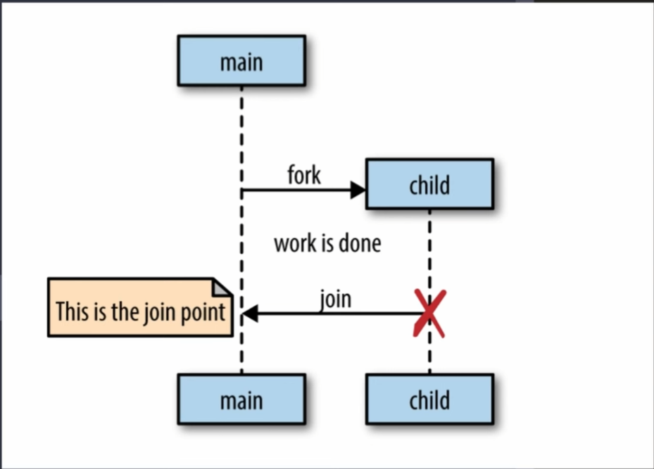
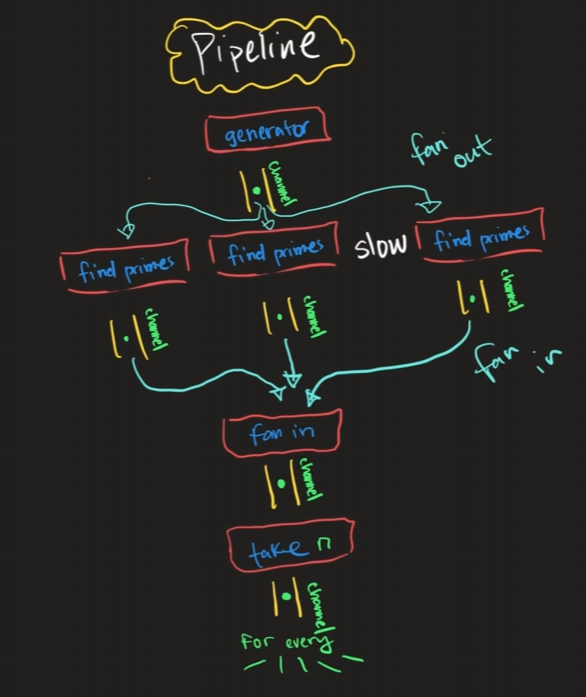

# Advanced Golang Concepts

- Resources [youtube](https://www.youtube.com/@kantancoding)

## Closures

1. Suppose we have the following code

   ```go
    package main

    import "fmt"
    func activate100RsGiftCard() func(int) int {
        amount := 100
        debitFunc := func(debitAmount int) int {
            amount -= debitAmount
            return amount
        }
        return debitFunc
    }

    func main() {
        dF := activate100RsGiftCard()
        fmt.Println("Bought chocolate for 25 Rs, the giftcard amout left is", dF(25)) // amount left is 75
        fmt.Println("Bought chips for 15 Rs, the giftcard amout left is", dF(15)) // amount left is 60
        fmt.Println("Bought toffees for 10 Rs, the giftcard amout left is", dF(10)) // amount left is 50
    }
   ```

2. Here above, the `activate100RsGiftCard()` returns a func that takes an integer value as parameter and returns an integer value. The function uses a local variable of the activate100RsGiftCard() and perform operations on it.
3. Now, after the code line `dF := activate100RsGiftCard()`, ideally, the variable `amount` should gets created and destroyed as activate100RsGiftCard() returned the debtFunc and exited from the callstack. The scope of the amount variable is over after activate100RsGiftCard() returned
4. But, in further calls, the debitAmount sent to the debitFunc is still being debited from the amount variable although `amount` variable's scope should be over
5. This is the concept of closures, as the `debitFunc()` is still dependent on the `amount` variable that is defined outside of itself.
6. **The golang will enclose both the function and any variables that it depends on, defined/declared outside the function, and store it as an enclosed unit known as closure**. The function can access the outside variables and perform operations on it whenever required.
   As should below:
   ```
    // In memory
    // as closure
    amount = 100
    debitFunc := func(debitAmount int) int {
            amount -= debitAmount
            return amount
        }
   ```

## Generics

1. Suppose you have slices of different number (int and float) types and you need to write functions to get the sum of all the values in them:
   ```go
        numbers1 := []int{1, 2, 3, 4, 5}
        numbers2 := []int32{1, 2, 3, 4, 5}
        numbers3 := []int64{1, 2, 3, 4, 5}
        numbers4 := []float32{1.0, 2.0, 3.0, 4.0, 5.0}
        numbers5 := []float64{1.0, 2.0, 3.0, 4.0, 5.0}
   ```
2. Ideally, we should write separate functions to handle the slices of each type which increases the code duplicacy
3. We can define a type Number which can expect any int and float
   ```go
        type Number interface {
            int | int32 | int64 | float32 | float64
        }
   ```
4. Now, we can define a function `NumberSum` which can expect any type defined in Number by using Generics syntax.
5. The generic syntax:- `func <name>[<type-name> <type>](<params>){}`
   For example: `func NumberSum[T Number](values []T) T`. Here Number can be anything amoung `int | int32 | int64 | float32 | float64` and T is the type Number. So if Number is int64 then the T will also be int64
   It also means `T` can accept anytype defined in Number
6. Thus, we can write a common function using generics as follows

   ```go
        func NumberSum[T Number](values []T) T {
            var s T;
            for _, val := range values {
                s += val
            }
            return s
        }

   ```

## Interfaces

1. Suppose you have the main application which needs to connect to some database.
2. We need to create database package that will have some functions needed by the main application to perform the database tasks.
3. Suppose you have user info in main application and your want to perform CRUD operations in database using the user info. For this, you will need the following functions:
   1. createUser(userInfo)
   2. readUser(userId)
   3. updateUser(userId, userInfo)
   4. deleteUser(userId)
4. For any database package to be used by our main application, we need to implement the above functions in it.
5. Also, we might change the database in future if needed. For example, we might start using NoSQL database.
6. If we pass the database object of a specific type in the main application and in future we have to change to the database, then we have to make changes to the main application code as well. As we can see here: [App using database without intefaces](./38InterfacesAdvanced/app-without-interface/main.go)
7. We can avoid the above behaviour by using Interfaces.
8. In our application, instead of creating new application by passing an db object, we can pass an interface to it. Any db package which implements the interface is eligible for crreating out application object. As we have implemented here: [App using database with interface](./38InterfacesAdvanced/app-with-interface/main.go)

## Abstraction

1. Abstraction is the process of exposing only the relevant attributes and behaviors of an object or function, while hiding its implementation details.
2. Abstraction is implemented by using interfaces in go
3. Suppose you are working on an application which uses a package, say `vending-machine` package, which some other team is working on parallely. Ideally you have to wait for other team to complete the code of the package first and then you will be able to integrate the package in your application. This is might hinder the parallel working of both the teams.
4. In golang, you can use abstraction using interfaces in your application to enable the parallel development by both the teams
5. First, both the teams will decide the functions and their signatures that the main application team will need and the other team will be going to implement in the `vending-machine` package.
6. After this, the main application team can create an interface containing the decided functions and their signatures and write code for the application.
7. When the vending-machine package team is done with the code on their side, then the main applcation team only has to import the package and pass it to the application like we are doing here: [Abstraction](./39Abstraction/main.go)
8. Here, just by using abstraction and not knowing how the implementation of the decided functions is done, we have used the functions in our main application.
9. We have decoupled our main application and vending-machine package

## Compositions

1. Suppose you have 2 structs, say Car and Truck. Both of them can have some different functionalities like Truck is 4WD and car can be a covertable one. They can have same functionalities as well like both of them will have engine which can start or stall, similarly both of them can have gears which can be either shifted up and shifted down
2. Composition help us to share common functionalities between types. This will help us in preventing the code duplicacy
3. From our above example, we can see that the functionalities like `Start()`, `ShiftUp()`, `TurnLeft()` are common amoung the Truck and Car whereas the functionalities like `FourWheelDrive()` and `ConvertTop()` are specific to Truck and Car respectively
4. Thus, if we dont use compositions, then we have to reimplement the common functionlities for all the vehicle types which will increase the code duplicacy and also we have same change in multiple places. Like we are doing here: [Code without Composition](./40Composition/without-composition/main.go)
5. Here, [Code with Composition](./40Composition/with-composition/main.go), we have created specific structs for common functionalities and added them to the Car and Truck as composition so they also get those functionalities embedded in them

## Go Concurrency Patterns

### Primitives for go concurrency patterns

1. Three primitives used to build Go concurrency patterns:
   1. Go routines
   2. Channels
   3. Select
2. Go routines:
   1. main() function acts as the parent to all the functions we call in our go program
   2. We can fork some functions off from the main thread to execute then parallely using the `go func <name>{}` syntax. These forked off functions are called as Go routines.
   3. If the main function gets executed and returned before other go routines, it forked, the go routines will also exit whether their work is done or not.
   4. Once we fork off some go routines from main() to perform some tasks, we need to join the go routines back to the main() to get the work done by them. Go routines will not join back the main(), automatically, after their work completion. We need some way to connect them back to the main()  
      
3. Channels:

   1. Channels are used to communicate information between go routines
   2. Go routines run independent of each other without requiring knowledge of other routines by default
   3. in order for our go routines to communicate with each other, we create some space in memory and the go routines will reference that same memory space. This memory space is called channel
   4. Suppose we have a 2 go routines running, r1 and r2. Suppose r1 wants to send some data to r2. We can create a channel, c1. r2 will listen from the channel and r1 will send data to the channel
   5. Channels can be considered as queue that can hold and release data in FIFO manner
   6. r1 can push any amount of data to channel and r2 will read the data from the channel in FIFO manner.
   7. Note: main() is also a go routine
   8. The channels can be unbuffered and buffered:

      1. unbuffered channels:

         1. Declaration syntax: `ch := make(chan <type>)`
         2. unbuffered channels are blocking in nature. If you are reading data from an unbuffered channel, whether it is the main thread or any other go routine, the go routine's execution will be holded at the line of code where it is reading from the channel. It will only be unblocked once it recieves some value from the channel Thus while using unbuffered channels and reading data from the channel, make sure you have a someone sending the data to it. You cannot send or recieve data in the same function from the same unbuffered channel. This is because as soon as you send data to the channel, you have to consume it. But if you are doing both sending and reading data from channel in the same function, you wont be able to achieve the above condition due to sync execution of code within the same function.
         3. If you dont have a sender of data to the channel but have a reciever of the data from the channel, in case of unbuffered channels, it will result in error due to the blocking nature of the reciever or reader code.
         4. But, it you have a sender but no reciever, in that case the program will not throw any error and the sent data to the channel will be lost as there is no reciever
         5. Unbuffered channels are used to do synchronous communication between go routines because for every sender we need a corresponding receiver
         6. In blocking code:

            1. ```go

                  func main(){
                     ch := make(chan string) // unbuffered channel

                     go func(){
                        ch <- "data"
                     }()

                     msg := <-ch // blocking code
                  }

               ```

            2. The code line `msg := <-ch` is blocking as the main() will wait for some data from channel.
            3. There are 2 scenarios where the code will be unblocked:
               1. **`msg` gets some data from the channel, or**
               2. **The channel, `ch`, is closed by some go routine**. If the channel is closed, the reciever will get a close msg which can "" in case of string chan, or 0 in case of int channel etc

      2. Buffered Channels

         1. Buffered channels are channels which have a fixed mentioned capacity.
         2. Syntax:
            1. `buffCh := make(chan string, 3)`, this will create buffCh with capacity 3
         3. Buffered channels are non blocking in nature unlike unbuffered channels. It means you dont need a receiver of the value first, here, before putting values to the channel
         4. Buffered channel can hold specified number of values if needed without blocking the go routine
         5. If you put more values than the assigned one in buffered channel then in will block the go routine. Refer to [file](./42GoConcurrency/channels/buffered-channel/main.go) for some scenarios
         6. Buffered channels make the communication between go routines asynchronous

4. Select statement

   1. It lets a go routine wait on multiple comuunication operations means it can let a go routine wait on messages from multiple channels
   2. For example:

      ```go
         func main() {

         ch1 := make(chan string)
         ch2 := make(chan int64)

         go func() {
            ch1 <- "data"
         }()

         go func() {
            ch2 <- 10
         }()

         select {
         case msg1 := <-ch1:
            fmt.Println("Message received from channel ch1", msg1)
         case msg2 := <-ch2:
            fmt.Println("Message received from channel ch2", msg2)
         }

      }

      ```

   3. A select statement is going to block until one of the above case can run. It means in above case, select is going to block until it receives msgs from any one of the channels.
   4. If the select receives values from multiple channels at the same time, then it will choose one case at random and execute the code in its block

### Go concurrency patterns

1. for-select loop
   1. Go routine leak:
      1. Sometimes we triggers some go routines that runs for life time till the main() is returned or the service is restarted
      2. This is intentional and unintentional
      3. If there is an unintentionaly and infinitely running go routine, we call it Go routine leak
   2. To prevent the go routine leak, we make use of done channel concept.
      1. In this, we create a channel, named done, in the parent go routine and pass it to the child go routine. This child go routine may run infinitely
      2. The child go routine will use the select cases to do its work. But we will put first case in select which will be listening to the done channel expecting some data
      3. In parent go routine, we can close the done channel anytime which will be propogated to the select case in the child go routine that can cause the child go routine to return preventing it from running infinitely
      4. Reference: [for-select](./43GoConcurrencyPatterns/for-select/main.go)
2. Pipeline
   1. We can have some data in raw form and we need to convert it to some form by performing multiple operations on it.
   2. For each operation we can have a stage dedicated. Each stage expects data in some format and transforms it by performing operations on it and tranfer it to the next stage.
   3. This setup is called pipeline.
      1. `SOURCE ----raw data----> STAGE 1 -----transformed data----> STAGE 2 -----more transformed data----> DESTINATION `
   4. Using go routines, we can parallelize the working of stages in pipeline for faster execution.
   5. Reference [code](./43GoConcurrencyPatterns/pipelines/main.go)
   6. We can have [generators](./43GoConcurrencyPatterns/generators/main.go) in the code, generating data continously and we might want to funnel that data into our pipeline which will process the data and give some meaningful output
   7. Suppose, we have a generator generating some random numbers. We want to create a pipeline where we have Stage1 which generates the random numbers, Stage2 where we filter out the numbers which are prime and Stage3 where we accept only n prime integers from the Stage2
      1. `STAGE 1 ----random integers----> STAGE 2 -----prime integers----> STAGE 3 -----output n prime integers---> END`
      2. Here, if we notice the STAGE2, finding primes, is a slow stage because it involves computation of whether the integer is prime or not.
      3. Since, we are only getting random integers in STAGE 2. The integers will not have any relation to each other. So we can scale the STAGE 2 to have multiple instances and each instance is processing (filtering prime integers) the data comming from STAGE 1.
      4. We can then combine the results of different instances of STAGE 2 in single channel and send it to STAGE 3 for outputing n prime integers  
         
      5. [Code](./43GoConcurrencyPatterns/processing-data-from-generator/main.go)
